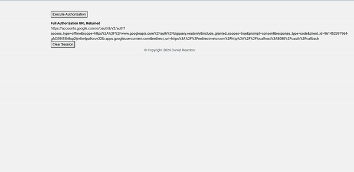

# Simple OIDC OAuth With BigQuery Row-level Restriction
This will setup a simple web application which will prompt a user to log in and display their oauth access token as well as use that access token on the server side to query BigQuery data with row-level restrictions enabled for two users. In this case:
- mega-dev@example.com
- mega@example.com

## Google Disclaimer
This is not an officially supported Google product

## Resulting Demo


## Setup Environment
```BASH
#Setup Environment variables
export ORGANIZATION_ID=[ORG_ID]
export PROJECT_NAME=[PROJECT_NAME]
export REGION=[REGION]
export BILLING_ACCOUNT=[BILLING_ID]

printf 'Y' | gcloud projects create --name=$PROJECT_NAME --organization=$ORGANIZATION_ID
export PROJECT_ID=$(gcloud projects list --filter=name:$PROJECT_NAME --format 'value(PROJECT_ID)')
export PROJECT_NUMBER=$(gcloud projects list --filter=name:$PROJECT_NAME --format 'value(PROJECT_NUMBER)')
gcloud beta billing projects link $PROJECT_ID --billing-account=$BILLING_ACCOUNT

gcloud config set compute/region $REGION
gcloud config set project $PROJECT_ID

printf 'y' |  gcloud services enable orgpolicy.googleapis.com
printf 'y' |  gcloud services enable compute.googleapis.com 
printf 'y' |  gcloud services enable artifactregistry.googleapis.com
printf 'y' |  gcloud services enable cloudbuild.googleapis.com
printf 'y' |  gcloud services enable bigquery.googleapis.com
```

## Address Any Environment Restrictions (Optional)
```BASH
cat > allowedPolicyMemberDomains.yaml << ENDOFFILE
name: projects/$PROJECT_NUMBER/policies/iam.allowedPolicyMemberDomains
spec:
  rules:
  - allowAll: true
ENDOFFILE
gcloud org-policies set-policy allowedPolicyMemberDomains.yaml
```

### Establish Sample Big Query Data and Restriction
```BASH
bq --location=US mk -d \
    --default_table_expiration 3600 \
    --description "This is a sample dataset" \
    sample_data

cat > schema.json << ENDOFFILE
[
    {
        "name": "unique_id",
        "type": "INTEGER",
        "mode": "REQUIRED"
    },
    {
        "name": "firstname",
        "type": "STRING",
        "mode": "REQUIRED" 
    },
    {
        "name": "lastname",
        "type": "STRING",
        "mode": "REQUIRED"
    }
    ,
    {
        "name": "email",
        "type": "STRING",
        "mode": "REQUIRED"
    } 
]
ENDOFFILE

bq mk \
    --table \
    --schema schema.json \
    --expiration 864000 \
    sample_data.names 

cat > data.csv << ENDOFFILE
1,Alice,Smith,mega@example.com
2,Bob,Johnson,mega@example.com
3,Charlie,Lee,mega@example.com
4,David,Brown,mega@example.com
5,Emily,Davis,mega@example.com
6,Frank,Wilson,mega-dev@example.com
7,Grace,Miller,mega-dev@example.com
8,Henry,Clark,mega-dev@example.com
9,Isabella,Garcia,mega-dev@example.com
10,Jack,Martinez,mega-dev@example.com
ENDOFFILE

bq load \
  --source_format=CSV \
 sample_data.names \
  ./data.csv

CREATE ROW ACCESS POLICY user_row_filter
ON sample_data.names
GRANT TO ('domain:example.com')
FILTER USING (email = SESSION_USER());

#DROP ALL ROW ACCESS POLICIES user_row_filter
#ON sample_data.names
```

## Deploy Application
```BASH
export SERVICE_NAME=oauthexample
gcloud run deploy $SERVICE_NAME \
   --source . \
   --region $REGION \
   --allow-unauthenticated \
   --set-env-vars "SESSION_SECRET=[NODEJS_SECRET]" \
   --set-env-vars "CLIENT_SECRET=[OAUTH_CLIENT_SECRET]" \
   --set-env-vars "CLIENT_ID=[OAUTH_CLIENT_ID]" \
   --set-env-vars "DATASET_ID=sample_data" \
   --set-env-vars "PROJECT_ID=[PROJECT_ID]" \
   --set-env-vars "TABLE_ID=names" \
   --set-env-vars "API_KEY=[API_KEY]"

DEPLOYMENT_URL=$(gcloud run services describe $SERVICE_NAME --region $REGION --format 'value(status.url)')

gcloud run services update $SERVICE_NAME \
   --region $REGION \
   --update-env-vars "CALLBACK_URL=$DEPLOYMENT_URL/oauth/callback"
```